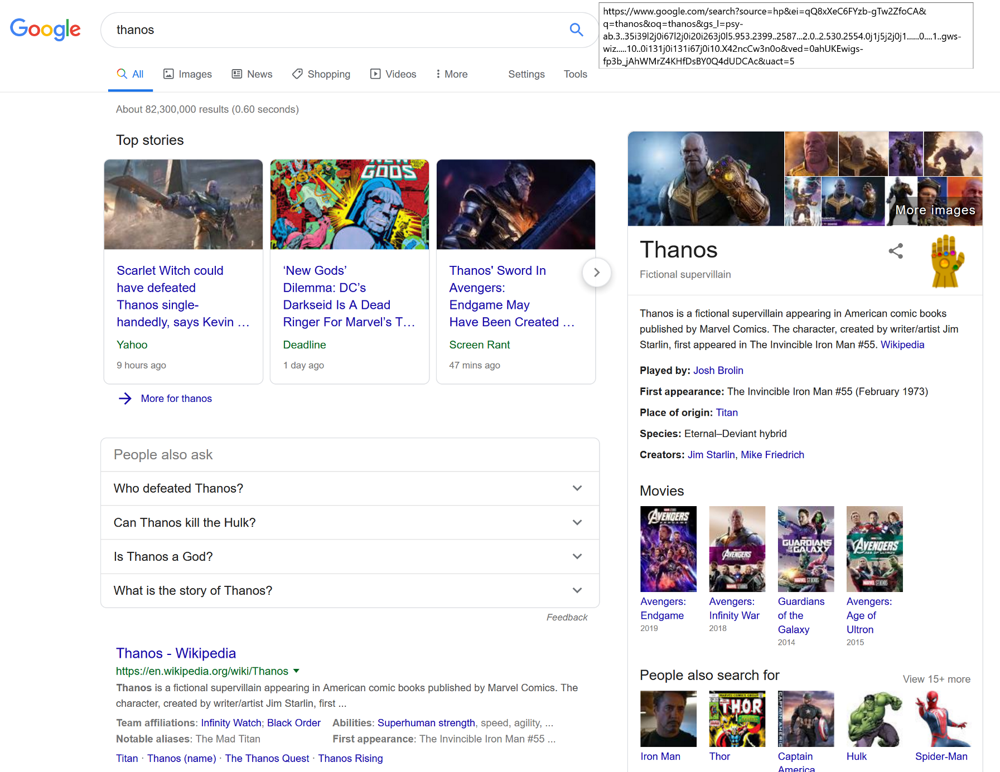
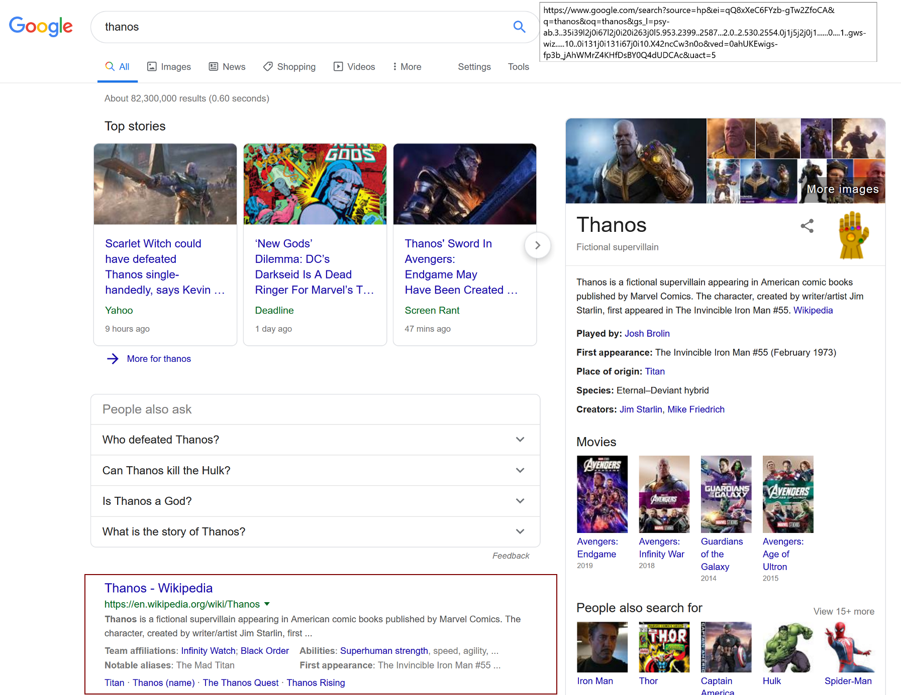

# Perfectly balanced, as all things should be

This bookmarklet is an attempt at making something useful with a very basic knowledge of javascript
and supporting technologies.

We'll start easy, from basic functionality on the browser to eventually manipulating and finally 
making the page perfectly balanced. What is that you want to make perfectly balanced is up to you.

## 2) Let's find our desired element

We'll use google's search result page as a basis for the rest of the workshop.

We'll start by identifying the elements that we want to modify. For this workshop let's focus on the elements that are in the results panel.

----
by Carlos Giraldo,

Expedia

